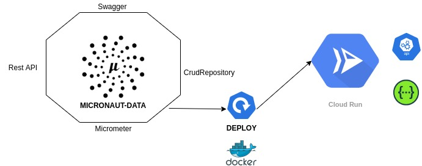
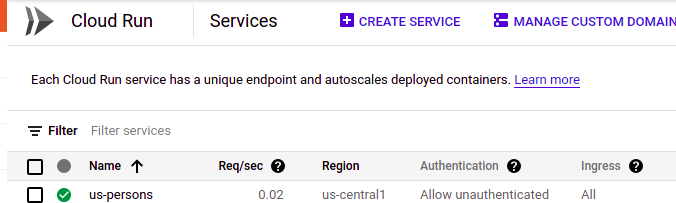
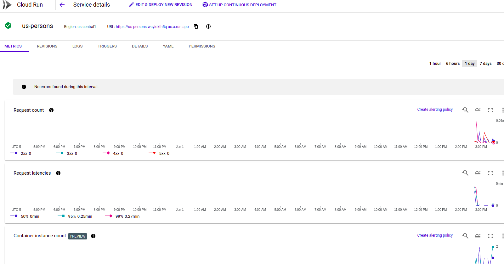

# REST API WITH MICRONAUT AND CLOUD RUN DEPLOYMENT

> Deployment Rest Api with Micronaut Data + Swagger Api. We will work from start to finish in the creation 
> and documentation of a REST API application, with access to data, enable metrics in the application and deployment in Cloud Run.



## Install Micronaut SDK

> First we will install the sdk for micronaunt to create a project with micronaut, 
> we will use the following commands :

```bash
curl -s "https://get.sdkman.io" | bash
source "$HOME/.sdkman/bin/sdkman-init.sh"
sdk version
sdk install micronaut
```

## Micronaut generated project

> Generate the project with the command mn create-app, and use the features or dependencies for the application.

```bash
mn create-app org.example.micrnaut-data  --features=jdbc-tomcat,logback,h2,data-jpa,hibernate-validator,lombok,micrometer-prometheus --lang=java  --build=maven
```

## Getting Started

> To get started, let's configure some tools in the application

#### Swagger Open API Definition
```java
@OpenAPIDefinition(
        info = @Info(
                title = "Api de Personas",
                version = "1.0.0",
                description = "Person API",
                license = @License(name = "Apache 2.0", url = "https://walavo.tk"),
                contact = @Contact(url = "https://walavo.tk", name = "Alvaro Aguinaga", email = "alvaro@gmail.com")
        ),
        servers = {
                @Server(url = "http://localhost:9080", description = "Server Local"),
                @Server(url = "https://walavo-persons-gzn4kc6qva-uc.a.run.app", description = "Server Cloud Run")

        }
)
public class OpenApiConfiguration {
}
```

```yaml
micronaut:
  router:
    static-resources:
      swagger:
        paths: classpath:META-INF/swagger
        mapping: /swagger/**
      redoc:
        paths: classpath:META-INF/swagger/views/redoc
        mapping: /redoc/**
      rapidoc:
        paths: classpath:META-INF/swagger/views/rapidoc
        mapping: /rapidoc/**
      swagger-ui:
        paths: classpath:META-INF/swagger/views/swagger-ui
        mapping: /swagger-ui/**
```

#### Micrometer Metrics Endpoint

> The metrics endpoint returns information about the "metrics" of the application. To execute the metrics endpoint, send a GET request to /metrics

```yaml
---
endpoints:
  prometheus:
    sensitive: false
---
micronaut:
  metrics:
    enabled: true
    sensitive: false
    export:
      prometheus:
        enabled: true
        step: PT1M
        descriptions: true
```
### Configuration H2 Database embedded

> Embedded database connection settings

```yaml
datasources:
  default:
    url: jdbc:h2:mem:devDb;MVCC=TRUE;LOCK_TIMEOUT=10000;DB_CLOSE_ON_EXIT=FALSE
    driverClassName: org.h2.Driver
    username: sa
    password: ''
    schema-generate: CREATE_DROP
    dialect: H2
---
jpa:
  default:
    properties:
      hibernate:
        hbm2ddl:
          auto: update
        format_sql: true
        show_sql: true
    entity-scan:
      packages: 'package entity scan'
```

### Development with Rest Api and Micronaut 

> In true Spring style. Micronaut, has annotations to declare the class as a controller and annotate the methods to be defined as http operations. 
> Also, we will declare Swagger annotations for REST API documentation as shown in the following example:

```java
@Validated
@Controller("/api/v1/persons")
public class PersonController {

    @Inject
    private ProductService productService;

    @Operation(summary = "Create Persons",
            description = "Create persons in the data base"
    )
    @ApiResponse(content = @Content(mediaType = "application/json"))
    @ApiResponse(responseCode = "400", description = "Invalid Name Supplied")
    @ApiResponse(responseCode = "404", description = "Person not found")
    @Tag(name = "persons")
    @Post(consumes = MediaType.APPLICATION_JSON, produces = MediaType.APPLICATION_JSON)
    public HttpResponse<?> save(@Valid @Body Person person) throws Exception {
        return HttpResponse.status(HttpStatus.CREATED)
                .body(productService.savePerson(person));
    }

    @Operation(summary = "Update Persons",
            description = "Update persons in the data base"
    )
    @ApiResponse(content = @Content(mediaType = "application/json"))
    @ApiResponse(responseCode = "400", description = "Invalid Name Supplied")
    @ApiResponse(responseCode = "404", description = "Person not found")
    @Tag(name = "persons")
    @Put(consumes = MediaType.APPLICATION_JSON, produces = MediaType.APPLICATION_JSON)
    public HttpResponse<?> update(@Valid @Body Person person) throws Exception {
        return HttpResponse.status(HttpStatus.OK)
                .body(productService.updatePerson(person));
    }

    @Operation(summary = "Delete Persons",
            description = "Delete persons in the data base"
    )
    @ApiResponse(content = @Content(mediaType = "application/json"))
    @ApiResponse(responseCode = "400", description = "Invalid Name Supplied")
    @ApiResponse(responseCode = "404", description = "Person not found")
    @Tag(name = "persons")
    @Delete(value = "/{id}",consumes = MediaType.APPLICATION_JSON, produces = MediaType.APPLICATION_JSON)
    public HttpResponse<?> delete(@PathVariable("id") Long id) throws Exception {
        return HttpResponse.status(HttpStatus.OK)
                .body(productService.deletePerson(id));
    }

    @Operation(summary = "Found Persons",
            description = "Found all persons in the data base"
    )
    @ApiResponse(content = @Content(mediaType = "application/json"))
    @ApiResponse(responseCode = "400", description = "Invalid Name Supplied")
    @ApiResponse(responseCode = "404", description = "Person not found")
    @Tag(name = "persons")
    @Get(produces = MediaType.APPLICATION_JSON)
    public HttpResponse<?> findAll() {
        return HttpResponse.status(HttpStatus.OK)
                .body(productService.findAllPersons());
    }

    @Operation(summary = "Found Persons by ID",
            description = "Found persons by ID in the data base"
    )
    @ApiResponse(content = @Content(mediaType = "application/json"))
    @ApiResponse(responseCode = "400", description = "Invalid Name Supplied")
    @ApiResponse(responseCode = "404", description = "Person not found")
    @Tag(name = "persons")
    @Get(value = "/{id}", produces = MediaType.APPLICATION_JSON)
    public HttpResponse<?> findById(@PathVariable("id") Long id) {
        return HttpResponse.status(HttpStatus.OK)
                .body(productService.findByIdPersons(id));
    }
}
```

### Micronaut Data 

> Like Spring Data.
>
> Micronaut Data is used to access data from databases. The CrudRepository extension allows automatic 
> generation of CRUD (Create, Read, Update, Delete) operations.  
>
> Micronaut Data provides a general API to translate a compile-time query model 
> into a compile-time query.
  
> JPA (Hibernate)
>
> SQL (JDBC)
>
>
> Dependency 
>
```xml
<dependency>
    <groupId>io.micronaut.data</groupId>
    <artifactId>micronaut-data-hibernate-jpa</artifactId>
    <version>2.4.3</version>
</dependency>
```

> You can then define an @Entity:
>
```java
@AllArgsConstructor
@NoArgsConstructor
@Data
@Entity
@Table(name = "persons")
@Schema(name = "PersonModel", description = "Person Manager")
public class Person {

    @Id
    @GeneratedValue(strategy = GenerationType.AUTO)
    private Long id;

    @Schema(description = "Person name", maximum = "20", required = true, example = "Alvaro daniel")
    @NotEmpty(message = "Can not be empty")
    @Size(min = 1, max = 20)
    private String name;

    @Schema(description = "Person name", maximum = "20", required = true, example = "Aguinaga Delgado")
    @NotEmpty(message = "Can not be empty")
    @Size(min = 1, max = 20)
    private String lastName;

    @Min(18)
    @Schema(description = "Person age", maximum = "18", required = true, example = "29")
    private Integer age;

    @Schema(description = "Person telephone", maximum = "10", required = true, example = "985898787")
    @NotEmpty(message = "Can not be empty")
    @Size(min = 1, max = 10)
    private String telephone;

    @Schema(description = "Person document", maximum = "12", required = true, example = "47856344")
    @NotEmpty(message = "Can not be empty")
    @Size(min = 1, max = 12)
    @Column(unique = true)
    private String document;

    @Schema(description = "Person email", required = true, example = "alvaro@gmail.com")
    @NotEmpty(message = "Can not be empty")
    @Email(message = "Email not correct")
    private String email;

    @Schema(description = "Person address", required = true, maximum = "200", example = "CALLE SAN MIGUEL 222")
    @NotEmpty(message = "Can not be empty")
    @Size(min = 1, max = 200)
    private String address;

    @JsonFormat(shape = JsonFormat.Shape.STRING, pattern = "yyyy-MM-dd")
    private LocalDate birthDate;

    @Schema(description = "Person gender", required = true)
    private Gender gender;

}
```

> To define a repository in Micronaut Data we use the @Repository annotation and we can use the same features as in 
> Spring Data (Query Native, Query Method Pattern, JPA-QL, Query Projections, Query Criteria, others).

```java
@Repository
public interface PersonRepository extends CrudRepository<Person, Long> {

    @Query(value = "FROM Person p WHERE p.document = :document")
    Optional<Person> findByDocument(String document);
    
    Optional<Person> findByName(String name);
}
```

> In the reactive business logic layer, we will access the repository and make queries and transactions to the database. 
> Finally the business layer is called in the controller. 
>
```java
@Slf4j
@Singleton
public class ProductService {

    @Inject
    private PersonRepository personRepository;

    public Single<Person> savePerson(Person person) throws Exception {
        validatePersonExists(person);
        return Single.just(personRepository.save(person))
                .onErrorReturnItem(Person.instance());
    }

    public Single<Person> updatePerson(Person person) throws Exception {
        validatePersonExists(person);
        return findByIdPersons(person.getId())
                .map(personFound -> PersonUtil.updateEntity(person, personFound))
                .map(personRepository::update)
                .onErrorReturnItem(Person.instance());
    }

    public Single<Person> deletePerson(Long id) throws Exception {
        validatePersonExists(Person.builder().id(id).build());
        return findByIdPersons(id)
                .map((Person entity) -> {
                    personRepository.delete(entity);
                    return entity;
                })
                .onErrorReturnItem(Person.instance());
    }


    public Observable<Person> findAllPersons() {
        return Observable.fromIterable(personRepository.findAll())
                .subscribeOn(Schedulers.io());
    }

    public Single<Person> findByIdPersons(Long id) {
        return Single.just(personRepository.findById(id).orElse(Person.instance()));
    }
}
```

### Build And Deployment 

### Compile project micronaut with maven wrapper

> This shell script is at the root of the project, we will use it to compile the already generated project.

```bash
.\mvnw clean install
```

> Create an Image with **Multi-Stage** Docker File.

```dockerfile
FROM maven:3.3-jdk-8
WORKDIR /artifact
COPY . /artifact
RUN mvn clean install
RUN ls -la

FROM openjdk:8
ENV ARTIFACT_ID=micronaut-data

RUN apt-get update \
	&& apt-get install -y ca-certificates \
	&& update-ca-certificates \
	&& apt-get install -y tzdata
	ENV TZ=America/Lima

WORKDIR /artifact
COPY --from=0 /artifact/target/${ARTIFACT_ID}-*.jar app.jar
COPY --from=0 /artifact/src/main/resources .
RUN ls -lF
RUN mkdir -p /${ARTIFACT_ID}/resources
COPY src/main/resources/* /${ARTIFACT_ID}/resources/
CMD ["sh","-c","java -jar app.jar -Duser.timezone=America/Lima ${JAVA_OPTS}"]
RUN du -sh /var/cache/apt
```

> Build a local Docker image with the Dockerfile already created.

```bash
docker build --build-arg ARTIFACT_ID . -t us-persons:1.0.0
```

> Run local docker image.

```bash
docker run -d --name us-persons -e APP_PORT=8080 -p 8080:8080 us-persons:1.0.0
```

> Create a local tag container registry to publish to the Google Cloud container registry

```bash
docker tag us-persons:1.0.0 gcr.io/[PROJECT ID]/us-persons:1.0.0
```

# GCP CLOUD RUN

> Google Cloud solution to publish http/https web applications in an easy and scalable way. Cloud Run offers you several 
> integrations for continuous integration, as CLI gcloud, git repository, Cloud Build, others.

### Benefits
 * Container to production in seconds
 * Fully managed
 * Enhanced developer experience

### Pre requirements

 * Install SDK gcloud
 * Google Account

> We are going to access the GCP console with the account created Google

```bash
gcloud auth login
```

> With the tag created that we are based on the image created locally, we are going to publish the tag in the container registry

```bash
gcloud auth configure-docker
docker --  push gcr.io/${PROJECT_ID}//us-persons:1.0.0
```

> Deploy the service API in Cloud Run and verify the deployment in the GCP console.

```bash
gcloud beta run deploy us-persons 
--image gcr.io/${PROJECT_ID}/us-persons:${VERSION}
--set-env-vars APP_PORT=8080 
--platform managed 
--allow-unauthenticated  
--cpu=1
--memory=512Mi
--region=us-central1
```

> Deployed correctly





## HTTP Client Side

#### Save Person

```bash
curl --location --request POST 'https://us-persons-xfrmmz5d4a-uc.a.run.app/api/v1/persons' \
--header 'Content-Type: application/json' \
--data-raw '{
    "name": "Celeste",
    "lastName": "Suarez",
    "document": "47081901",
    "age": "29",
    "telephone": 986809251,
    "birthDate": "1992-05-27",
    "gender": "M",
    "email": "Celeste.suarez8@gmail.com",
    "address": "Calle la villa"
}'
```

#### Update Person

```bash
curl --location --request PUT 'https://us-persons-xfrmmz5d4a-uc.a.run.app/api/v1/persons' \
--header 'Content-Type: application/json' \
--data-raw '{
    "id": 1,
    "name": "Maria Celeste",
    "lastName": "Suarez",
    "document": "47081901",
    "age": "29",
    "telephone": 986809251,
    "birthDate": "1992-05-27",
    "gender": "M",
    "email": "Celeste.suarez8@gmail.com",
    "address": "Calle la villa"
}'
```
#### Delete Person

```bash
curl --location --request DELETE 'https://us-persons-xfrmmz5d4a-uc.a.run.app/api/v1/persons/1'
```

#### Get ALL Person

```bash
curl --location --request GET 'https://us-persons-xfrmmz5d4a-uc.a.run.app/api/v1/persons'
```

#### Find By ID Person

```bash
curl --location --request GET 'https://us-persons-xfrmmz5d4a-uc.a.run.app/api/v1/persons/1'
```

#### Api Swagger

```bash
curl https://us-persons-xfrmmz5d4a-uc.a.run.app/swagger/views/rapidoc/index.html
curl https://us-persons-xfrmmz5d4a-uc.a.run.app/swagger/views/swagger-ui/index.html
```

#### Endpoint Monitoring

```bash
curl --location --request GET 'https://us-persons-xfrmmz5d4a-uc.a.run.app/health'
curl --location --request GET 'https://us-persons-xfrmmz5d4a-uc.a.run.app/metrics'
curl --location --request GET 'https://us-persons-xfrmmz5d4a-uc.a.run.app/routes'
```

## Conclusions

We have seen the whole picture from the construction and documentation of a REST API with Micronaut,
and to access the data with Micronaut Data. Then build an image with Docker Multi-Stage. Next, 
publish the image to the GCP container registry. Finally, deploy with the GCLOUD CLI in Cloud Run 
to enable our API and be able to create an ecosystem of microservices in high availability and easy to deploy.

## Next steps

- Enable Monitoring with Grafana
- Improve Swagger ui interface
- Deploy with continuous integration tools


## References

## Started Micronaut

- [https://micronaut-projects.github.io/micronaut-starter/latest/guide/#installation](https://micronaut-projects.github.io/micronaut-starter/latest/guide/#installation)

## Micronaut Data

- [https://micronaut-projects.github.io/micronaut-data/latest/guide/](https://micronaut-projects.github.io/micronaut-data/latest/guide/)

## Api Swagger

- [https://micronaut-projects.github.io/micronaut-openapi/latest/guide/index.html](https://micronaut-projects.github.io/micronaut-openapi/latest/guide/index.html)

## Cloud Run Deploy

[https://cloud.google.com/sdk/gcloud/reference/beta/run/deploy](https://cloud.google.com/sdk/gcloud/reference/beta/run/deploy)

## Docker Multi Stage

[https://docs.docker.com/develop/develop-images/multistage-build/](https://docs.docker.com/develop/develop-images/multistage-build/)


## Feature jdbc-tomcat documentation

- [Micronaut Tomcat JDBC Connection Pool documentation](https://micronaut-projects.github.io/micronaut-sql/latest/guide/index.html#jdbc)

## Feature hibernate-validator documentation

- [Micronaut Hibernate Validator documentation](https://micronaut-projects.github.io/micronaut-hibernate-validator/latest/guide/index.html)

## Feature lombok documentation

- [Micronaut Project Lombok documentation](https://docs.micronaut.io/latest/guide/index.html#lombok)

- [https://projectlombok.org/features/all](https://projectlombok.org/features/all)

## Feature Micrometer Prometheus documentation

- [https://micronaut-projects.github.io/micronaut-micrometer/latest/guide/#metricsEndpoint)](https://micronaut-projects.github.io/micronaut-micrometer/latest/guide/#metricsEndpoint)